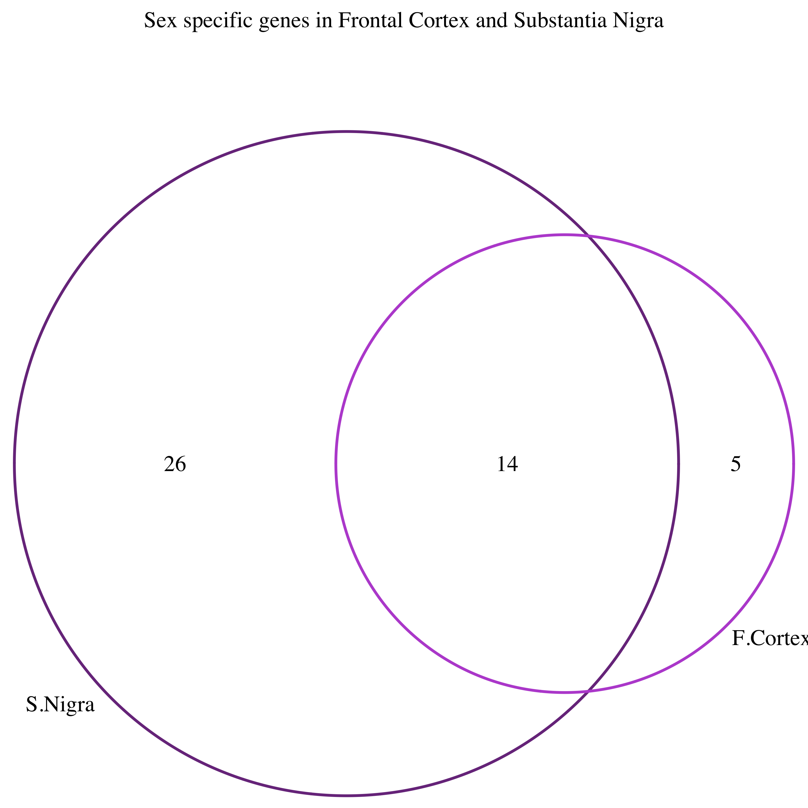
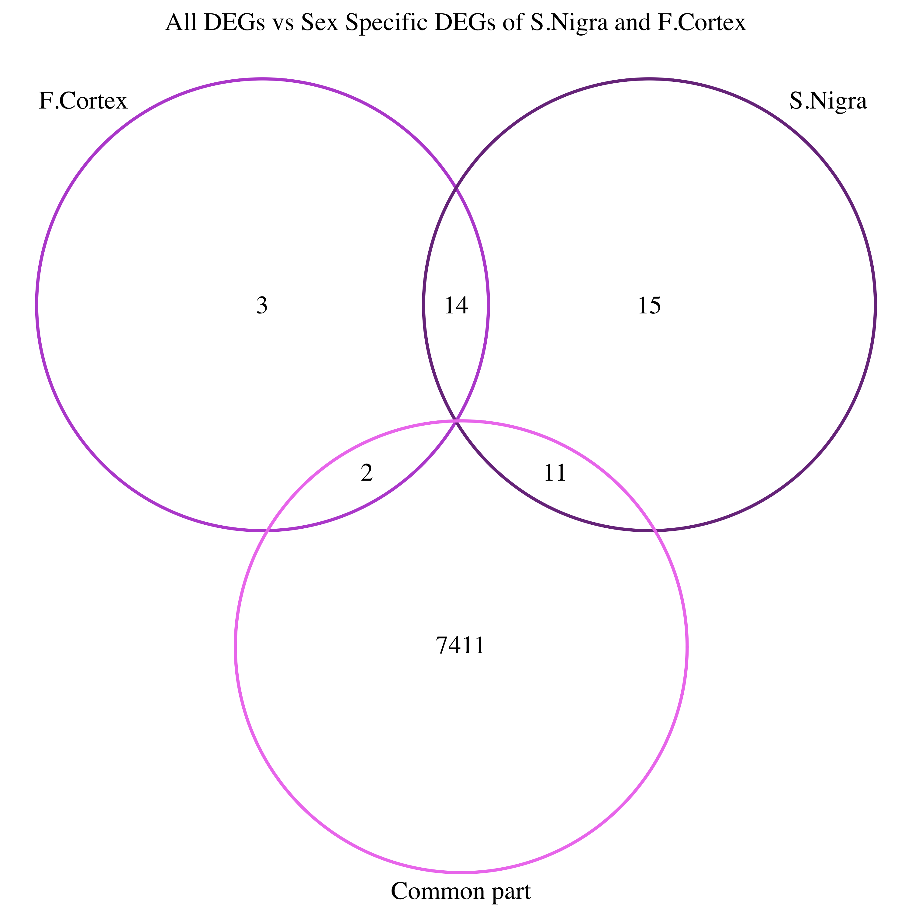

# COMMON PART

## *PREMISE*

For the first part of this project we are asked to work on a human gene expression profiling RNA-Seq dataset composed by 36 samples from 6 tissues.

Of the \~ 56k human genes that are annotated in the GenCode annotation only 28266 high quality genes have been retained. For each sample we have the expression values (read counts) for:

-   18829 (high quality) proteing coding genes
-   9438 (high quality) non protein coding RNAs (6520 lincRNA, 1780 snRNAs and 1137 miRNAs)

### **DATASET FILES:**

1.  <div>

    | **Data.csv:**
    | a table containing gene expression values (read counts) for the 28266 human genes in the 36replicates

    </div>

2.  <div>

    | **Annot.csv:**
    | a table containing the annotation (gene symbol and class) for the 28266 genes

    </div>

3.  <div>

    | **Conditions.csv**:
    |  a table containing the experimental design of the RNAseq (i.e the tissue, individual and sex associated with each biological replicate)

    </div>

4.  <div>

    | **GO.table.csv.zip:**
    | gene ontology annotation for all the Gencode proteincoding genes

    </div>

### **OBJECTIVES**

use the ***edgeR*** package in order to:

1.  Read the data into a ***DGEList*** object

2.  Keep only genes that are likely to be expressed (i.e genes that have more than 10 reads in at least 1 replicate)

3.  Perform normalization (both for library size and composition)

4.  Perform a MDS (\~PCA) plot of the data

5.  Select 2 different (and meaningful) biological conditions and perform a differential expression analysis using the ***`exactTest()`*** function

6.  Create a topTags type of edgeR object containing the list of differentially expressed genes (DEGs) with FDR **≤** 0.01

7.  Assign all the genes into one of the 4 possible classes: \| -DE_UP (FDR**≤** 0.01 and logFC\>0), \| -DE_DOWN (FDR**≤** 0.01 and logFC\<0), \| -notDE_UP (FDR\>0.01and logFC\>0), \| -notDE_DOWN (FDR\>0.01 and logFC\<0), \| **boxplot** of the **logFC** of the genes belonging to each class

    ## DEVELOPMENT

In this part of the project we are asked to use the ***edgeR*** package, available through the ***Bioconductor*** repository to analyze our data.

#### 1.1

So the first thing to do is to load the Bioconductor software package manager in your environment through the code : ***`install.packages("BiocManager")`***

Then we need to install the ***edgeR*** package package:

```{r Install edgeR, message=FALSE}
#BiocManager::install("edgeR")
```

And at last we need to select the package **edgeR** from our library

```{r Select edgeR}
library(edgeR)
```

Now that we are set to work with edgeR we need to load the data in our environment;

```{r Data Load}
setwd("~/Documents/BIOTECHIE/Unimi/Methods in Bioinformatics/info18/files_method_bioinformatics_exam")
raw_counts <- read.csv("data.csv", header = T,  sep = "\t", row.names = 1) 
group <- read.csv("conditions.csv", header = T, sep = "\t", row.names = 1)
#row.names=1 because the objects of the first column give the names to the different rows of the data frame
#header= TRUE because the objects of the first row give the names to the different columns of the data frame
```

Since we don't know the actual order of the id of the replicates within the ''data.csv'' and within the ''conditions.csv'' files we order them ourselves with the following code:

```{r Order}
#with this line of code we create a dataframe which will have as columns names the names of the rows in the data.frame 'group' in the SAME order
counts <- raw_counts[,rownames(group)] 
#this instead is a logical vector that demonstrate that what we have done is correct
colnames(counts) == rownames(group)
```

Now that we have installed ***edgeR*** and we have the data ready to use we need to create a ***DGEList*** ***object*** with the ***`DGEList()`*** function. Since we're at it we can also filter the genes that have 0 counts through the ***`remove.zeros`*** parameter.

```{r DGEList}
#we set that the library size of each replicate (counts columns) is equal to the sum of each value whithin the column i.e. the reads of each gene for each condition
countsDGE <- DGEList(counts= counts, group = group$tissue, remove.zeros = T, lib.size =colSums(counts))
```

#### 2.1 {#section-1}

Once we have a ***DGEList*** object (in our case countsDGE) we need to filter genes that are unlikely to be expressed. We need to remove from our counts data.frame (that now is an object whithin the DGEList) genes that have **less than** **10 counts in every replicate.**

Basically we create a logical data.frame by applying the **condition \>10** to the counts dataframe within the DGEList; we apply a sum to the rows (by using the function ***`apply()`*** ) of the resulting logical data.frame so that we obtain a value for each gene (row) that expressin **how many** **replicates** (columns) the gene has more than 10 reads. From here we apply the **condition \>0** to the result of the ***`apply()`*** so that i can compute a logical data.frame that will tell which genes have ***at least 10 reads per replicate***. At last by indexing this logical data.frame into the counts data.frame i can select only the expressed genes.

```{r Filter}
#we have summarized this operation in one string of code
countsDGE$counts <- countsDGE$counts[apply(countsDGE$counts>10,1,sum)>0,]
```

#### 3.1

As a normalization method to reduce biases between libraries we use the **TMM** method which basically consist in scaling the library size of each replicate by a normalization factor. This will prevent us to consider falsely down/up-regulated genes in a sample. To apply this type of normalization we apply the ***`calcNormFactors()`*** function to the ***DEGList*** we have obtained before.

```{r TMM}
#this will add a column named "norm.factors" ro the samples data.frame of the DEGList
N.countsDGE <- calcNormFactors(countsDGE, method = "TMM")
```

#### 4.1

to perform a ***MDS plot*** of the data within our ***DGEList*** we need to use the ***`plotMDS()`** function*

```{r MDS}

DiffCol <- c("red","orange","blue","green","mediumorchid1","black")[N.countsDGE$samples$group]
plotMDS(N.countsDGE, col=DiffCol, pch = 19)
legend("topright",fill=c("red","orange","blue","green","mediumorchid1","black"),legend=levels(N.countsDGE$samples$group))

```

#### 5.1 {#section-4}

To perform differential expression analysis, we need first to fit the **Negative Binomial** statistical model to our data by using ***`estimateDisp()`*** function. The model is going to be fitted automatically once we run the function and the results are saved in the **DGEList** object. Then we need to select **two different, meaningful conditions** (in our case Substantia Nigra and Frontal Cortex) onto which we want to perform the differential expression analysis by using the ***`exactTest()`*** function.

```{r NB Fitting}
#if not specified the type of dispersion used will be tagwise
D.countsDGE <- estimateDisp(N.countsDGE)
#by using exactTest an object DGEExact is returned
eT <- exactTest(D.countsDGE, pair = c("Frontal Cortex (BA9)","Substantia nigra"))

```

#### 6.1 {#section-5}

To extract **DEGs (differentialy expressed genes)** with **FDR** (**False Discovery Rate) ≤0.01** from our **DGEExact** object (which is basically a list returned by the function ***`exactTest()`*** ) we need to use the ***`topTags()`*** function. We are not filtering genes with **FDR≤0.01** now because we are doing the selection of genes classes for FDR and logFC in the next objective.

```{r not Filtered DEGs}
Ctt <- topTags(eT, n=nrow(eT)) 
#these are the genes that are presumably DE but that are not yet filtered for an FDR
```

#### 7.1 {#section-6}

Now, I have to divide in 4 classes **all genes** depending on **logFC** (**logarithmic Fold Change)** and **FDR.** Genes with an **FDR ≤0.01** will be **DEGs** and, depending on the **logFC**, they will be either up-regulated (logFC\>0) or down-regulated (logFC\<0).

```{r Filtered Degs}
#real DEGs have an FDR lower than 0.01
DE_UP <- (Ctt[Ctt$table$FDR <= 0.01 & Ctt$table$logFC>0,])
DE_DOWN <- (Ctt[Ctt$table$FDR <= 0.01 & Ctt$table$logFC<0,])
#genes that have an FDR higher than 0.01 are not considered DEGs
notDE_UP <- (Ctt[Ctt$table$FDR > 0.01 & Ctt$table$logFC>0,])
notDE_DOWN <- (Ctt[Ctt$table$FDR > 0.01 & Ctt$table$logFC<0,])
```

Finally we can do the **boxplot** of the **logFC** of the **DEGs** belonging to each class

```{r DEGs Boxplots}
par(mfrow=c(2,2))#to visualize the boxplots in a 2x2 grid
boxplot(DE_UP$table$logFC, main = "logFC DE_UP", outline = F, col = 'mediumorchid')
boxplot(DE_DOWN$table$logFC, main = "logFC DE_DOWN", outline = F, col = 'mediumorchid2')
boxplot(notDE_UP$table$logFC, main = "logFC notDE_UP", outline = F, col = 'mediumorchid4')
boxplot(notDE_DOWN$table$logFC, main = "logFC notDE_DOWN", outline = F, col = 'violet')
```

# PART 2: PROJECT \#2

## PREMISE

For the second part of this Project we choose the ***"Project \#2"*** option where we are asked to work on the data that we obtained while developing the tasks objectives that were set in the ***"Common part".***

### OBJECTIVES

1.  Identify genes showing sex specific expression in the 2 tissues that you considered for the "common part".

    • Perform a PCA (principal component analysis) to ascertain whether there is separation between biological replicates of different sexes

    • For each tissue, consider only genes expressed (\>10 reads in at least 2 replicates) in that tissue.

    • Use edgeR ***`(exactTest)`*** to perform a differential expression analysis

    • Consider all the genes that show a FDR **≤**0.05 as "sex specific"DEGs

2.  Draw a Venn Diagram of the Sex specific genes between the 2 tissues

3.  How many genes are sex specific in both tissues?

4.  Finally draw a Venn Diagram between the DEGs (as identified in the common part) and genes that show Sex specific expression in at least one of the tissues considered.

5.  How many genes that are DE between the 2 tissues are also DE between the 2 sexes? Do you expect to see many? Why?

## DEVELOPMENT

#### 1.2

To identify genes showing sex specific expression in the 2 tissues that we considered for the "common part" **(in our case Substantia Nigra and Frontal Cortex)** I need first to filter out the two tissues within the data.frame in which we express the conditions for each replicate (the 'group' data.frame) and within the data.frame in which we have the read counts for each gene in different conditions. This can easily be done by indexing.

```{r S.Nigra Fr. Cortex filter}
#first we filter the conditions of the replicates for which neither Frontal Cortex nor Substantia Nigra is sampled
group2 <- group[-c(1:12,19:30),] 
#then we filter out gene counts that are referring only to the replicates for which our tissues are sampled by indexing the columns of the columns of the counts data.frame
counts2 <- counts[,rownames(group2)]
```

From here on we are going to focus on completing the tasks for **ONE** tissue and then repeat all the procedure for the other tissue. We will be back working on both genes at the same time on the second objective task.

First of all i need to do the same procedure as I've done in the previous code chunk but only for one of the two tissue.

```{r Subsetting Fr. Cortex}
#Subsetting Frontal Cortex
groupFrC <- group2[-c(7:12),]
countsFrC <- counts2[,rownames(groupFrC)]

```

Now, we can proceed with creating the **DGEList** object for our tissue of interest containing genes showing sex specific expression by using the ***group*** parameter. We need to keep only genes that are expressed for **more than 10 reads in at least 2 replicates.** The filtering part is basically the same one observed in task [2.1](#section-1) of the common part but this time we set the condition **condition \>1** to the result of the ***`apply()`*** because we need genes that have more than 10 reads in at least **2 replicates.**

```{r Filtering}
#we need to set group = groupFrC$sex to add to the DEGList object a column in the samples data.frame that assigns the sex membership of each sample
DGEFrC <- DGEList(counts = countsFrC, group = groupFrC$sex)
DGEFrC$counts <- DGEFrC$counts[apply(DGEFrC$counts>10,1,sum)>1,]
```

And now we can proceed with the normalization through **logFC normalization** and **TMM normalization** methods.

```{r Normalization}
#normalization
DGEFrC <- calcNormFactors(DGEFrC)
#pseudocounts are essential to deal with 0s
logDGEFrC <- log(DGEFrC$counts + 0.01)
```

At this point is possible to perform an adeguate **PCA (principal component analysis)** to ascertain whether there is separation between biological replicates of different sexes by using the function ***`prcomp()`.*** With a PCA basically we are observing how much the overall expression pattern is different from one replicate to another. In this case we are considering how much the expression changes from replicates associated to different sexes.

```{r PCA}
#PCA 
col.sex <- c("pink","lightblue")[DGEFrC$samples$group]
#it is essential to apply the prcomp() function on the columns of the data.frame containing the counts because the columns contain the id of each replicate; i need to compare the replicates, not the genes
PCAFrC <- prcomp(t(logDGEFrC))
plot(PCAFrC$x, col = col.sex, pch = 19, main = "Frontal Cortex PCA")
legend("bottomright",fill = c("pink","lightblue"), legend = levels(DGEFrC$samples$group))
```

As we have seen in the task [5.1](#section-4). of the common part before performing a differential expression analysis we need first to fit the **NB (Negative Binomial)** statistical model to our data by using ***`estimateDisp()`***

```{r NB Fitting Fr. Cortex}
D.DGEFrC <- estimateDisp(DGEFrC)
```

Now we need to use the function ***`exactTest()`*** to perform the differential expression analysis.

```{r DEGs}
eTFrC <- exactTest(D.DGEFrC, pair = c(1,2))
```

we can proceed now with considering all genes that show FDR **≤** 0.05 as "sex specific" DEGs using the ***`topTags()`*** function and filtering data as we have seen in task [6.1](#section-5) and [7.1](#section-6) of the common part.

```{r filtered DEGs}
FrCTT <- topTags(eTFrC, n=nrow(eTFrC))
#in task 7 we filtered data both for logFC and for FDR, here we filter only for an FRD
genes_sex_spec <- FrCTT[FrCTT$table$FDR <= 0.05,]
#header genes
head(genes_sex_spec)
```

Genes obtained this way are coded with Ensembl code; we can exploit ***biomaRt*** in order to obtain **HGNC Symbol**, making them more clear to read. We can use the ***`useEnsembl()`*** and ***`getBM()`*** functions to achieve this goal.

```{r used genes legend}
library(biomaRt)
ensembl = useEnsembl(biomart = "ensembl", dataset = "hsapiens_gene_ensembl")
genes_used <- getBM(attributes = c("ensembl_gene_id", "hgnc_symbol"), filters = "ensembl_gene_id",values = rownames(genes_sex_spec), mart = ensembl)
genes_used
```

Now we can repeat each and every step of what we have done for the Frontal cortex sample tissue for the Substantia Nigra sample tissue.

```{r all about Substantia Nigra}

#Subsetting Substantia Nigra

groupSubNig <- group2[c(7:12),]
countsSubNig <- counts2[,rownames(groupSubNig)]

#DGEList + filtering
DGESubNig <- DGEList(counts = countsSubNig, group = groupSubNig$sex)
DGESubNig$counts <- DGESubNig$counts[apply(DGESubNig$counts>10,1,sum)>1,]

#Normalization TMM + log scaling
DGESubNig <- calcNormFactors(DGESubNig)
logDGESubNig <- log(DGESubNig$counts + 0.01)

#PCA

col.sex <- c("pink","lightblue")[DGESubNig$samples$group]
PCASubNig <- prcomp(t(logDGESubNig))

plot(PCASubNig$x, col = col.sex, pch = 19, main = "Substantia Nigra's PCA")
legend("bottomright", fill = c("pink","lightblue"), legend = levels(DGESubNig$samples$group))

#Diff expression analysis to extract sex specific genes in Substantia Nigra
#as in part 1 we need at first to estimate dispersion. We already computed normalization and applied filtering as requested.

D.DGESubNig <- estimateDisp(DGESubNig)

#Fisher exact test

eTSubNig <- exactTest(D.DGESubNig, pair = c(1,2))

#After Fisher exact test, we can proceed with considering all genes that show FDR <= 0.05
#as sex specific DEGs

#Let's compute TopTags

SubNigTT <- topTags(eTSubNig, n=nrow(eTSubNig))

#... and then filter out our genes

genes_sex_spec2 <- SubNigTT[SubNigTT$table$FDR <= 0.05,]

#header genes
head(genes_sex_spec2)
genes_used2 <- getBM(attributes = c("ensembl_gene_id", "hgnc_symbol"), filters = "ensembl_gene_id",values = rownames(genes_sex_spec2), mart = ensembl)
genes_used2
```

#### 2.2 {#section-8}

Now we need to draw a Venn Diagram of the Sex specific genes between the 2 tissues. We can do that by simply using the ***`venn.diagram()`*** function through the ***VennDiagram*** package. The object of the function will be a List containing all sex specific genes for the two tissue and the output will be a ***.png*** file showing the Venn Diagram.

```{r Venn for common sex}
library('VennDiagram')
Frc_string <- rownames(genes_sex_spec)
SubNig_string <- rownames(genes_sex_spec2)
listalo <- list(Frc_string, SubNig_string)
venn.diagram(listalo, category.names = c("F.Cortex", "S.Nigra"),filename = "DEGsex.png", imagetype = "png",main = "Sex specific genes in Frontal Cortex and Substantia Nigra", col = c("mediumorchid", "mediumorchid4"))
```

#### 3.2

As we can see from the image there are 14 genes that are sex specific in both tissues



#### 4.2

Now we are asked to draw a Venn Diagram between **DEGs** identified in the common part and genes tha that show Sex specific expression in at least one of the tissues considered (either Substantia Nigra or Frontal Cortex). The steps are the same of the previous code chunk but now we consider whithin the list containing all sex specific genes for both tissues also a vector containing the names of all the **DEGs** identified in the step [7.1](#section-6) of the common part

```{r Venn DEGs and sex DEGs}
#VENN DIAGRAM between DEGs in common part (common part), S.Nigra and Fr. Cortex
Ctt_string <- rownames(Ctt[Ctt$table$FDR <= 0.01,])
Camillibus <- list(Frc_string, SubNig_string, Ctt_string)

venn.diagram(Camillibus, category.names = c("F.Cortex", "S.Nigra", "Common part"),filename = "j@mpaolo.png", imagetype = "png", main = "All DEGs vs Sex Specific DEGs of S.Nigra and F.Cortex",col = c("mediumorchid", "mediumorchid4", "violet"))

```

#### 5.2 {#section-11}

We can see from the Venn diagram that genes that are DE between the two tissues and the two sexes at the same time are 0. The 11 genes for the S.Nigra and the 2 genes for the F.cortex are sex specific DEGs but for only one of the two tissues. We had a small number of genes that were DE between the two sexes (45) and an even smaller number of genes that were sex specific for both tissues (14); if a gene would have been DE between the two tissues and also DE between the two sexes it would have been part of those 14 genes. It follows that we could not expect to see many or any genes at all that were DE between the two tissues and the two sexes at the same time because the number of genes that we were working with was too small.


